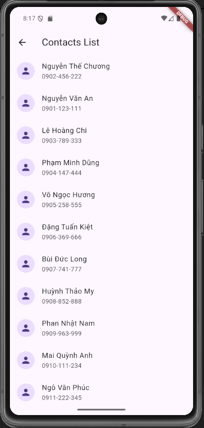
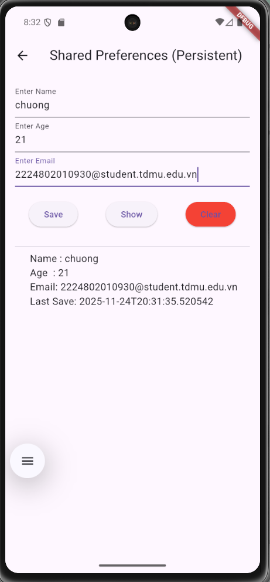
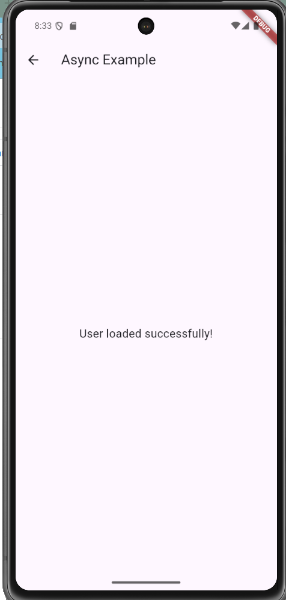
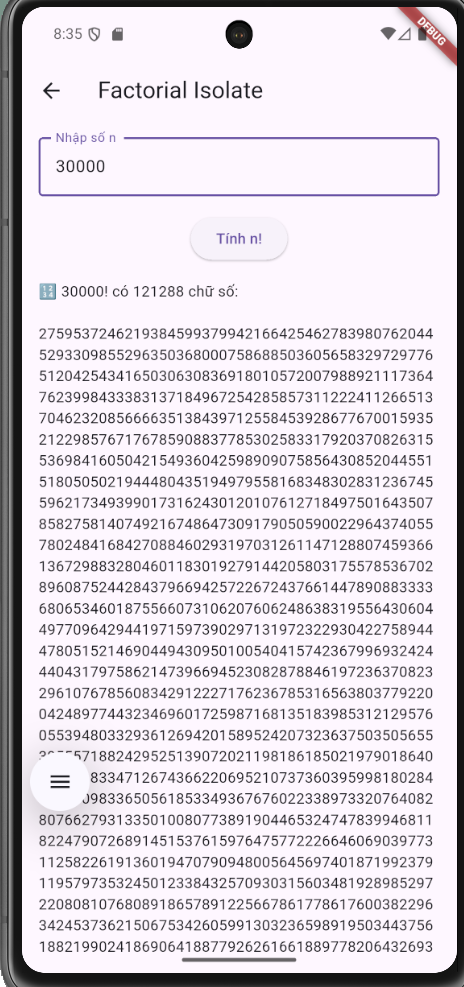
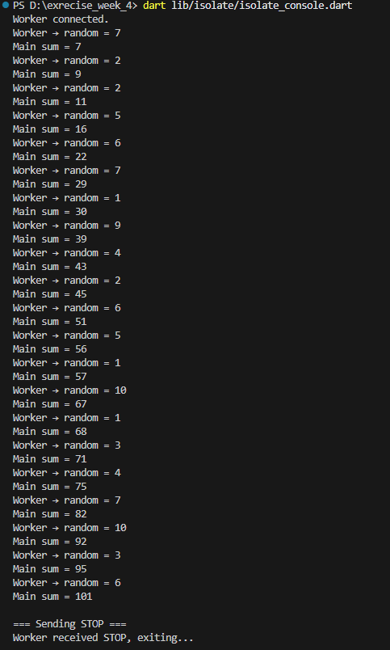

# 📦 **Flutter / Dart Exercises — Week 4**


## 🧱 **Project Structure**

```bash
lib/
 ├─ main.dart
 ├─ models/
 │   └─ contact.dart
 ├─ screens/
 │   ├─ list_contacts_screen.dart
 │   ├─ grid_gallery_screen.dart
 │   ├─ shared_pref_screen.dart
 │   ├─ async_user_screen.dart
 │   └─ factorial_isolate_screen.dart
 ├─ services/
 │   └─ storage_service.dart
 ├─ utils/
 │   └─ factorial.dart
 ├─ isolate/
 │   └─ isolate_console.dart
```

---

# 📂 1️⃣ ListView — Danh sách liên hệ

| Description         | Image                                  |
| ------------------- | -------------------------------------- |
| Contact List Screen |    |


## 🎯 Yêu cầu

* Model `Contact`
* List scrollable
* Avatar, name, phone

---

---

# ⚡️ 2️⃣ GridView Gallery — 12 ảnh / icon

### 📸 Screenshot

| Description                 | Image                                                        |
| --------------------------- | -------------------------------------------------------------|
| Grid Gallery (Fixed_Column) | .png) |


| Description               | Image                                                      |
| ------------------------- | -----------------------------------------------------------|
| Grid Gallery (Responsive) | .png)   | 
                                                            

## 🎯 Mục tiêu

* Section 1: `GridView.count()`
* Section 2: `GridView.extent()`
* Mỗi item:

  * Container bo góc
  * Icon/ảnh + label

---

---

# 💾 3️⃣ SharedPreferences — Lưu dữ liệu cục bộ

### 📸 Screenshot

| Description        | Image                                   |
| ------------------ | --------------------------------------- |
| Shared Pref Screen |    |

## 🎯 Chức năng

* TextField nhập tên
* Nút `Save`
* Nút `Show`
* Xử lý khi chưa có dữ liệu
* Bonus:

  * Clear
  * Save age & email
  * Timestamp

---

---

# 🔄 4️⃣ Async Programming — Load dữ liệu

### 📸 Screenshot

| Description       | Image                                      |
| ----------------- | ------------------------------------------ |
| Async User Screen |           |

## 🎯 Yêu cầu

* Hiển thị `"Loading user..."`
* `Future.delayed(3s)`
* Sau khi xong → `"User loaded successfully!"`

---

---

# 🧠 5️⃣ Isolate Factorial — Tính số lớn

### 📸 Screenshot

| Description            | Image                              |
| ---------------------- | ---------------------------------- |
| Factorial              |     |

## 🎯 Yêu cầu

* Nhập số N
* Tính `N!` bằng isolate (compute)
* Loading + progress
* UI không bị treo
* Hiển thị kết quả

---

---

# 🛰 6️⃣ Isolate Console — Worker & Main

### 📸 Demo (image)

| Description     | Image                            |
| --------------- | -------------------------------- |
| Console isolate |    |

## 🎯 Luồng xử lý

* Worker isolate → gửi random mỗi giây
* Main isolate → cộng liên tục
* Khi sum > 100 → gửi stop
* Worker → `Isolate.exit()`

---

---

# 🚀 Run Instructions

### Flutter App

```
flutter pub get
flutter run
```

### Console isolate

```
dart lib/isolate/isolate_console.dart
```

---

# 📦 Dependencies

```yaml
dependencies:
  flutter:
    sdk: flutter

  http: ^1.1.0
  shared_preferences: ^2.2.3
```

---

---

# 📚 Knowledge Summary

| Topic           | Technology                           |
| --------------- | ------------------------------------ |
| UI list & grid  | ListView, GridView                   |
| Local storage   | SharedPreferences                    |
| Async           | Future, async/await                  |
| Multithreading  | isolate, compute                     |
| Console isolate | Isolate.spawn + ReceivePort/SendPort |

---

